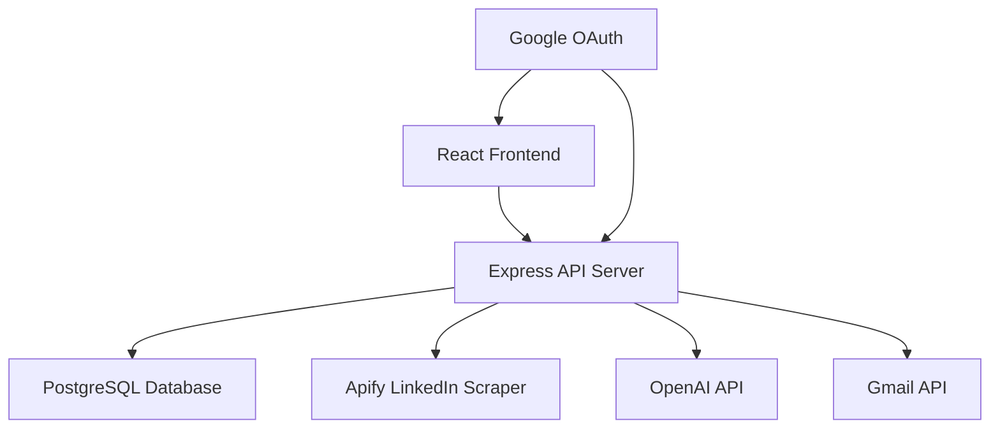

# AI JobHunter Developer Guide 🛠️

## Table of Contents
- [Architecture Overview](#architecture-overview)
- [Database Schema](#database-schema) 
- [API Endpoints](#api-endpoints)
- [Job Processing Pipeline](#job-processing-pipeline)
- [Frontend Components](#frontend-components)
- [Authentication System](#authentication-system)
- [Troubleshooting](#troubleshooting)
- [Development Workflow](#development-workflow)

## Architecture Overview

### System Components



### Technology Stack

**Frontend:**
- React 18 with TypeScript
- Vite for bundling
- Shadcn/ui + Radix UI components
- Tailwind CSS with custom utilities
- TanStack Query for state management
- Wouter for routing
- Framer Motion for animations

**Backend:**
- Node.js with Express.js
- TypeScript for type safety
- Drizzle ORM with PostgreSQL
- Passport.js for authentication
- Multer for file uploads

**External Services:**
- Apify for LinkedIn scraping
- OpenAI for email generation
- Google OAuth + Gmail API
- Neon serverless PostgreSQL

## Database Schema

### Core Tables

```sql
-- Users table
CREATE TABLE users (
    id VARCHAR PRIMARY KEY DEFAULT gen_random_uuid(),
    email VARCHAR UNIQUE NOT NULL,
    name VARCHAR,
    google_id VARCHAR,
    profile_picture VARCHAR,
    resume_text TEXT,
    resume_filename VARCHAR,
    resume_file_data TEXT,
    resume_mime_type VARCHAR,
    resume_uploaded_at TIMESTAMP,
    subscription_status VARCHAR DEFAULT 'free',
    subscription_plan VARCHAR,
    subscription_expires_at TIMESTAMP,
    created_at TIMESTAMP DEFAULT now(),
    updated_at TIMESTAMP DEFAULT now()
);

-- Job scraping requests
CREATE TABLE job_scraping_requests (
    id VARCHAR PRIMARY KEY DEFAULT gen_random_uuid(),
    user_id VARCHAR REFERENCES users(id),
    linkedin_url TEXT NOT NULL,
    resume_text TEXT,
    status VARCHAR DEFAULT 'pending',
    results JSONB,
    filtered_results JSONB,
    enriched_results JSONB,
    error_message TEXT,
    total_jobs_found INTEGER,
    free_jobs_shown INTEGER DEFAULT 0,
    pro_jobs_shown INTEGER DEFAULT 0,
    created_at TIMESTAMP DEFAULT now(),
    updated_at TIMESTAMP DEFAULT now(),
    completed_at TIMESTAMP
);

-- Email applications tracking
CREATE TABLE email_applications (
    id VARCHAR PRIMARY KEY DEFAULT gen_random_uuid(),
    user_id VARCHAR REFERENCES users(id),
    request_id VARCHAR REFERENCES job_scraping_requests(id),
    job_title VARCHAR NOT NULL,
    company_name VARCHAR NOT NULL,
    company_email VARCHAR,
    job_poster_name VARCHAR,
    job_poster_email VARCHAR,
    email_subject VARCHAR,
    email_body TEXT,
    gmail_message_id VARCHAR,
    status VARCHAR DEFAULT 'sent',
    sent_at TIMESTAMP DEFAULT now()
);

-- Gmail OAuth credentials
CREATE TABLE gmail_credentials (
    id VARCHAR PRIMARY KEY DEFAULT gen_random_uuid(),
    user_id VARCHAR UNIQUE REFERENCES users(id),
    access_token TEXT,
    refresh_token TEXT,
    token_expiry TIMESTAMP,
    scope TEXT,
    email_address VARCHAR,
    created_at TIMESTAMP DEFAULT now(),
    updated_at TIMESTAMP DEFAULT now()
);
```

### Data Flow

1. **User Registration**: Google OAuth creates user record
2. **Job Search**: User submits LinkedIn URL → creates `job_scraping_requests` 
3. **Processing**: Background job enriches data and updates request
4. **Email Sending**: Creates `email_applications` records for sent emails
5. **Gmail Integration**: Stores OAuth tokens in `gmail_credentials`

## API Endpoints

### Authentication Routes (`/api/auth`)

```typescript
// Get current user
GET /api/auth/user
Response: { id, email, name, profilePicture, subscriptionStatus }

// Google OAuth initiation  
GET /api/auth/google
Redirects to Google OAuth consent screen

// OAuth callback
GET /api/auth/google/callback?code=...
Processes OAuth response, creates/updates user

// Logout
POST /api/auth/logout
Destroys session
```

### Job Processing Routes (`/api`)

```typescript
// Start job scraping
POST /api/scrape-job
Body: { linkedinUrl: string, resumeText?: string }
Response: { requestId: string }

// Get scraping status
GET /api/scrape-job/:requestId  
Response: {
  id: string,
  status: "pending" | "processing" | "completed" | "failed",
  enrichedResults: {
    jobs: JobData[],
    freeJobs: number,
    lockedJobs: number,
    fakeTotalJobs: number
  },
  freeJobsShown: number,
  proJobsShown: number
}

// Abort scraping
POST /api/scrape-job/:requestId/abort
Cancels ongoing Apify actors
```

### Dashboard Routes (`/api/dashboard`)

```typescript
// Get user statistics
GET /api/dashboard/stats
Response: {
  totalJobsScraped: number,
  totalApplicationsSent: number,
  activeJobSearches: number,
  recentSearches: JobScrapingRequest[]
}
```

### Gmail Integration (`/api/auth/gmail`)

```typescript
// Check Gmail authorization status
GET /api/auth/gmail/status
Response: { authorized: boolean, email?: string, needsRefresh?: boolean }

// Initiate Gmail OAuth
GET /api/auth/gmail/authorize
Redirects to Google OAuth with Gmail scopes

// OAuth callback
GET /api/auth/gmail/callback?code=...
Stores Gmail credentials

// Send test email
POST /api/auth/gmail/send-test
Tests Gmail API connection

// Unlink Gmail account
DELETE /api/auth/gmail/unlink
Removes stored credentials
```

## Job Processing Pipeline

### 1. Input Validation

```typescript
function validateLinkedInUrl(url: string): boolean {
  const patterns = [
    /^https:\/\/www\.linkedin\.com\/jobs\/search/,
    /^https:\/\/linkedin\.com\/jobs\/search/
  ];
  return patterns.some(pattern => pattern.test(url));
}
```

### 2. LinkedIn Job Scraping

Uses Apify's LinkedIn Job Scraper:

```typescript
const run = await apifyClient.actor('curious_coder/linkedin-job-scraper').call({
  urls: [linkedinUrl],
  maxJobsPerQuery: 100,
  saveOnlyUniqueJobs: true,
  proxy: {
    useApifyProxy: true,
    apifyProxyGroups: ['RESIDENTIAL']
  }
});
```

### 3. Quality Filtering

```typescript
function isQualityJob(job: any): boolean {
  return job.jobTitle && 
         job.jobTitle.length > 0 &&
         job.companyName &&
         job.companyName.length > 0 &&
         job.description &&
         job.description.length > 100; // Minimum description length
}
```

### 4. Profile Enrichment

Scrapes LinkedIn profiles to find contact emails:

```typescript
async function enrichJobsWithProfiles(jobs: JobData[]): Promise<JobData[]> {
  const enrichedJobs = [];
  
  for (const job of jobs) {
    if (job.jobPosterLinkedinUrl) {
      const profileData = await scrapeLinkedInProfile(job);
      if (profileData?.email) {
        job.contactEmail = profileData.email;
        job.canApply = true;
      }
    }
    enrichedJobs.push(job);
  }
  
  return enrichedJobs;
}
```

### 5. AI Email Generation

```typescript
async function generateJobApplicationEmail(job: JobData, resumeText: string): Promise<string> {
  const prompt = `
    Generate a personalized job application email for:
    
    Job: ${job.jobTitle} at ${job.companyName}
    Contact: ${job.contactEmail}
    Job Description: ${job.description}
    
    My Resume: ${resumeText}
    
    Requirements:
    - Professional tone
    - Highlight relevant experience
    - Keep under 200 words
    - Include subject line
  `;
  
  const completion = await openai.chat.completions.create({
    model: "gpt-4",
    messages: [{ role: "user", content: prompt }],
    max_tokens: 300
  });
  
  return completion.choices[0].message.content;
}
```

### 6. Gmail API Integration

```typescript
async function sendJobApplicationEmail(
  user: User, 
  job: JobData, 
  emailContent: string,
  resumeAttachment?: Buffer
) {
  const gmail = google.gmail({ version: 'v1', auth: oauth2Client });
  
  const email = [
    `To: ${job.contactEmail}`,
    `Subject: Application for ${job.jobTitle}`,
    'Content-Type: multipart/mixed; boundary="boundary"',
    '',
    '--boundary',
    'Content-Type: text/plain; charset="UTF-8"',
    '',
    emailContent,
    '--boundary',
    'Content-Type: application/pdf',
    'Content-Disposition: attachment; filename="resume.pdf"',
    'Content-Transfer-Encoding: base64',
    '',
    resumeAttachment.toString('base64'),
    '--boundary--'
  ].join('\n');
  
  await gmail.users.messages.send({
    userId: 'me',
    requestBody: {
      raw: Buffer.from(email).toString('base64')
    }
  });
}
```

## Frontend Components

### Key Component Structure

```
client/src/
├── components/
│   ├── ui/                    # Shadcn/ui components
│   ├── job-scraper.tsx        # Main job search interface
│   ├── filtered-job-card.tsx  # Individual job display
│   └── dashboard-layout.tsx   # App layout wrapper
├── pages/
│   ├── home.tsx              # Dashboard page  
│   ├── results.tsx           # Job results display
│   └── login.tsx             # Authentication page
└── lib/
    ├── api.ts                # API client functions
    ├── auth.ts               # Authentication helpers
    └── utils.ts              # Utility functions
```

### State Management with TanStack Query

```typescript
// API client setup
export const apiRequest = async (url: string, options: RequestInit = {}) => {
  const response = await fetch(url, {
    ...options,
    headers: {
      'Content-Type': 'application/json',
      ...options.headers,
    },
  });
  
  if (!response.ok) {
    throw new Error(`API Error: ${response.status}`);
  }
  
  return response.json();
};

// Query hooks
export const useJobScrapingResult = (requestId: string) => {
  return useQuery({
    queryKey: ['/api/scrape-job', requestId],
    queryFn: () => apiRequest(`/api/scrape-job/${requestId}`),
    refetchInterval: 5000, // Poll every 5 seconds
    enabled: !!requestId
  });
};
```

### Real-time Progress Updates

```typescript
const Results: React.FC = () => {
  const { requestId } = useRoute('/results/:requestId');
  const { data: scrapingResult, isLoading } = useJobScrapingResult(requestId);
  
  const isProcessing = scrapingResult?.status === 'processing';
  
  return (
    <div>
      {isProcessing && (
        <ProgressBar 
          progress={calculateProgress(scrapingResult.status)}
          message="Finding and enriching job postings..."
        />
      )}
      
      {scrapingResult?.status === 'completed' && (
        <JobResults jobs={scrapingResult.enrichedResults.jobs} />
      )}
    </div>
  );
};
```

## Authentication System

### Google OAuth Flow

```typescript
// Passport Google Strategy
passport.use(new GoogleStrategy({
  clientID: process.env.GOOGLE_CLIENT_ID!,
  clientSecret: process.env.GOOGLE_CLIENT_SECRET!,
  callbackURL: "/api/auth/google/callback"
}, async (accessToken, refreshToken, profile, done) => {
  const existingUser = await getUserByGoogleId(profile.id);
  
  if (existingUser) {
    return done(null, existingUser);
  }
  
  const newUser = await createUser({
    googleId: profile.id,
    email: profile.emails?.[0]?.value!,
    name: profile.displayName,
    profilePicture: profile.photos?.[0]?.value
  });
  
  return done(null, newUser);
}));
```

### Session Management

```typescript
app.use(session({
  secret: process.env.SESSION_SECRET || 'default-secret',
  resave: false,
  saveUninitialized: false,
  store: new (ConnectPgSimple(session))({
    pool: pgPool,
    tableName: 'session'
  }),
  cookie: {
    secure: process.env.NODE_ENV === 'production',
    maxAge: 30 * 24 * 60 * 60 * 1000 // 30 days
  }
}));
```

### Protected Route Middleware

```typescript
async function requireAuth(req: Request, res: Response, next: NextFunction) {
  if (!req.session.userId) {
    return res.status(401).json({ message: 'Unauthorized' });
  }
  
  const user = await getUserById(req.session.userId);
  if (!user) {
    req.session.destroy(() => {});
    return res.status(401).json({ message: 'Unauthorized' });
  }
  
  req.user = user;
  next();
}
```

## Troubleshooting

### Common Issues

#### 1. LinkedIn Scraping Fails
**Symptoms:** Jobs not being scraped, empty results
**Solutions:**
- Check Apify API key validity
- Verify LinkedIn URL format
- Check Apify account credits
- Review rate limiting

#### 2. Contact Email Discovery Low Rate
**Symptoms:** Most jobs show as "Pro Plan" only
**Solutions:**
- This is normal behavior (~3% success rate)
- LinkedIn profiles must be public
- Job poster must have contact info visible

#### 3. Gmail API Issues  
**Symptoms:** Emails not sending, authorization errors
**Solutions:**
- Verify Gmail API enabled in Google Console
- Check OAuth scopes include Gmail
- Refresh OAuth tokens
- Test with Gmail API Explorer

#### 4. Database Connection Issues
**Symptoms:** 500 errors, connection timeouts
**Solutions:**
- Check DATABASE_URL format
- Verify PostgreSQL server status  
- Check connection pool limits
- Review Neon database status

#### 5. TypeScript Errors
**Symptoms:** Build failures, type errors
**Solutions:**
- Run `npm run type-check`
- Check Drizzle schema matches database
- Verify type imports are correct
- Use `any` types for complex dynamic data

### Debug Tools

#### Enable Debug Logging
```bash
export NODE_ENV=development
export DEBUG=express:*,drizzle:*
```

#### Database Query Logging
```typescript
const db = drizzle(client, { 
  schema,
  logger: process.env.NODE_ENV === 'development' 
});
```

#### API Response Logging
```typescript
app.use((req, res, next) => {
  console.log(`${req.method} ${req.path}`, req.body);
  next();
});
```

## Development Workflow

### Local Development Setup

1. **Environment Setup**
   ```bash
   cp .env.example .env
   # Configure all required environment variables
   ```

2. **Database Setup**
   ```bash
   npm run db:push  # Sync schema to database
   ```

3. **Start Development Server**
   ```bash
   npm run dev  # Runs both frontend and backend
   ```

### Code Quality Tools

```bash
# Type checking
npm run type-check

# Linting  
npm run lint
npm run lint:fix

# Formatting
npm run format

# Pre-commit hooks
npm run pre-commit
```

### Testing Strategy

```bash
# Unit tests
npm run test:unit

# Integration tests  
npm run test:integration

# E2E tests
npm run test:e2e

# All tests
npm run test
```

### Database Migrations

```bash
# Generate migration from schema changes
npm run db:generate

# Push schema changes to database
npm run db:push

# Force push (with data loss warning)
npm run db:push --force
```

### Performance Monitoring

Key metrics to monitor:
- Job scraping completion time
- Email generation latency  
- Database query performance
- API response times
- Memory usage during processing

### Security Considerations

- All API keys stored in environment variables
- OAuth tokens encrypted in database
- CSRF protection on state-changing operations
- Rate limiting on expensive operations
- Input validation on all user inputs
- SQL injection protection via ORM

---

## Contributing Guidelines

1. Fork the repository
2. Create feature branch (`git checkout -b feature/name`)  
3. Make changes following style guide
4. Add tests for new functionality
5. Update documentation as needed
6. Submit pull request with detailed description

For more information, see the main [README.md](README.md) file.